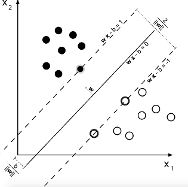
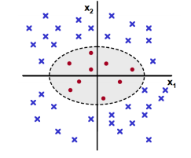
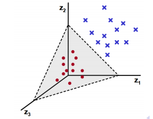

## Training and Evaluating Models  
I choose the following three supervised learning models for this dataset  
1. Support Vector Machines  
2. Gaussian Naive Bayes  
3. Some random algorithm 

Let's go over them one by one

### Support Vector Machines
**Applications of SVM**

 Support Vector Machine (SVM) is primarily a classier method that performs classification tasks by constructing hyperplanes in a multidimensional space that separates cases of different class labels.SVM supports both regression and classification tasks and can handle multiple continuous and categorical variables. As we saw in the same project, the categorical variables are turned into boolean variables by creating some dummy columns.
 
 SVMs can be used to perform both multi-class classification and regression.In addition to performing linear classification, SVMs can efficiently perform a non-linear classification by mapping their inputs into high-dimensional feature spaces.
 
 **Advantages of SVM**
 - SVMs do a great job in formulating non-linear decesion boundaries. Other supervised learning methods like Decesion Trees and Logistic regression won't give optimised results when the data is randomly distributed and there is no clear linear separation between them.
 -  By introducing the kernel, SVMs gain flexibility in the choice of the form of the threshold separating the different types of data. We can also write our custom kernels to specify the similarity between the data. This feature of writing custom kernels makes it very versatile.
 -  The SVMs gives a good generalization performance even in case of high-dimensional data and a small set of training patterns.

**Disadvantages of SVM**
- SVMs don't work well with large datasets because the time complexity of training them is of the order of O(N^3).From a practical point of view this is the most serious problem of the SVMs is the high algorithmic complexity and extensive memory requirements of the required quadratic programming in large-scale tasks.
- Also they don't work when the data contains a lot of noise and the classes are overalpping to each other.

**Why choose this model?**  
TO BE DONE

**Measurements from SVM**

| Training size       | Training time (s)      | Prediction time (s)  | Training F1   | Test F1   |
| -------------       |:-------------:         | -----:               | ------:       | ------:   |
| 100                 | 0.002                  | 0.001                |  0.886        | 0.785     |
| 200                 | 0.004                  | 0.003                |  0.88         | 0.792     |
| 296                 | 0.007                  | 0.007                |  0.883        | 0.805     |

### Gaussian Naive Bayes  
**Applications of SVM**
- Document Classification.remains a popular (baseline) method for text categorization
- Spam filtering. the problem of judging documents as belonging to one category or the other such as spam or legitimate
- It also finds application in automatic medical diagnosis
- credit approval
- Recommender system that predicts wheteher the user will like a given resource

**Advantages of Naive Bayes**  
- They require a small amount of training data to estimate the necessary parameters.
- Naive Bayes learners and classifiers can be extremely fast compared to more sophisticated methods.The decoupling of the class conditional feature distributions means that each distribution can be independently estimated as a one dimensional distribution. This in turn helps to alleviate problems stemming from the curse of dimensionality.
- Naive Bayes classifiers are highly scalable, requiring a number of parameters linear in the number of variables (features/predictors) in a learning problem

**Disadvantages of Naive Bayes**  
- apparently over-simplified assumptions
- On the flip side, although naive Bayes is known as a decent classifier, it is known to be a bad estimator, so the probability outputs are not to be taken too seriously.
- Naive Bayes assumes that the affect of an attribute value on a given class is independent of the value of other attributes.

**Why choose this model**  
TO BE DONE

**Measurements from Gaussian NB**  

| Training size       | Training time (s)      | Prediction time (s)  | Training F1   | Test F1   |
| -------------       |:-------------:         | -----:               | ------:       | ------:   |
| 100                 | 0.002                  | 0.001                |  0.352        | 0.179     |
| 200                 | 0.001                  | 0.001                |  0.793        | 0.729     |
| 296                 | 0.001                  | 0.001                |  0.818        | 0.789     |

### Random Forest Classifier
**Applications of Random Forest Classifier**
-Binomial Option Pricing- One of the most basic fundamental applications of decision tree analysis is for the purpose of option pricing. The binomial option pricing model uses discrete probabilities to determine the value of an option at expiration
- It can be used as an "instant physician" trained an autoassociative memory neural network to store a large number of medical records, each of which includes information on symptoms, diagnosis, and treatment for a particular case. After training, the net can be presented with input consisting of a set of symptoms; it will then find the full stored pattern that represents the "best" diagnosis and treatment
- In stock market business,many factors weigh in whether a given stock will go up or down on any given day

**Advantages of Random Forest Classifier**  
- Random forest runtimes are quite fast, and they are able to deal with unbalanced and missing data
- Random decision forests correct for decision trees' habit of overfitting to their training set.
- Lastly, the ability of automatically producing accuracy and variable importance and information about outliers makes random forests easier to use effectively
- The other main advantage is that, because of how they are constructed (using bagging or boosting) these algorithms handle very well high dimensional spaces as well as large number of training examples.
- random forests is not very sensitive to the parameters used to run it and it is easy to determine which parameters to use
- It gives estimates of what variables are important in the classification.

**Disadvantages of Random Forest Classifier**  
- when used for regression they cannot predict beyond the range in the training data, and that they may over-fit data sets that are particularly noisy
- Another issue related to regression is that random forests tends to overestimate the low values and underestimate the high values. This is because the response from random forests in the case of regression is the average (mean) of all of the trees.
- a large number of trees may make the algorithm slow for real-time prediction

**Why choose this model**  
TO BE DONE

**Measurements from Random Forest Classifier**  

| Training size       | Training time (s)      | Prediction time (s)  | Training F1   | Test F1   |
| -------------       |:-------------:         | -----:               | ------:       | ------:   |
| 100                 | 0.034                  | 0.002                |  0.992        | 0.750     |
| 200                 | 0.033                  | 0.002                |  0.992        | 0.744     |
| 296                 | 0.028                  | 0.002                |  0.987        | 0.748     |

## Choosing the best model 

### Which is the best model?

I think SVM is the best model for classifying the given data. The reasons for the same are as follows
**TODO:  choose the two best parameters and plot a graph**

- Among the three models, one model that is not at all performing well with this data is Gaussin NB classifier. Its F1 score for both the training and testing sets is extremely low compared to the other two classifiers.For training size of 100, it has a F1 score of .35 and so the test set performs poorly also in this case. Naive Bayes performs poorly i think because of the over simplified assumptions it makes. It never takes into consideration the effect of two attributes combined in the probability calculations. For example, in the data, the attributes `health` and `absences` are not independent of each other. Actually the arrtibute `abcenses`(the number of abscenses he has taken) is dependent on the attribute `health`(health of the student) and both of these can affect the result collectively. Again the attributes `traveltime`(time taken to travel to and from from school) is not independent of `studytime` ( the weekly time available for study). Also it doesn't take any parameters which can be tuned to improve its F1 score.

- Now comes the Forest Classifier and SVM. Among these models, Random Forest has an exteremely high F1 socre, which is a clear sign of overfitting and looks like it has not been able to generalize well over the data.
- The time complexity of training an SVM is of the order of O(N^3) while for a Random Forest, it is O(M(mn log n) where n is the number of  instances and m is the number of attributes, and M is the number of trees. However, for this amount of data, SVM performs 5 times better in terms of training time.
- Although the prediction time of training set in case of Random Forest is comparayively less than that of SVM, but in case of prediction time of test sets, its almost equal for both of them (0.002 s).

So based on the limited amount of data we have(400) and by observing the time complexity of these models, we can safely choose SVM for this purpose. In case of RFC, i think it needs more fine tuning of its parameters to overcome the problem of overfitting and if the data size is very large, it can outperform SVM in terms of time complexity.

### How does an SVM work?

An SVM is just a simple linear separator. It separates two classes by drawing a line between them. In layman's terms, it involves finding the hyperplane (line in 2D, plane in 3D and hyperplane in higher dimensions. More formally, a hyperplane is n-1 dimensional subspace of an n-dimensional space) that best separates two classes of points with the maximum margin.

&nbsp; &nbsp; &nbsp; &nbsp; &nbsp; &nbsp; &nbsp; &nbsp; &nbsp; &nbsp; &nbsp;&nbsp; &nbsp; &nbsp; &nbsp; &nbsp; &nbsp; &nbsp; &nbsp; &nbsp; &nbsp; &nbsp;&nbsp; &nbsp; &nbsp; &nbsp; &nbsp; &nbsp; &nbsp; &nbsp; &nbsp;

In the above diagram(image credit-Quora), there are two types of classes present represented as black and white circles. Now there are an infinite number of lines that can be drawn in the diagram to separate the black and white circles. But SVM chooses the line that maximises the distance between two points that are closest and belong to opposite classes.In the figure, that line is the middle one.

The closest points of which it is trying to maximize the diatnace are called as  the "support vectors" (the name "support vector machine" is due to the fact that points are like vectors and that the best line "depends on" or is "supported by" the closest points).In the above diagram,the points from which the lines `wx-b=1` and `wx-b=-1` passes are support vectors.The connecting lines between the closest points is drawn by doing vector subtraction (point A - point B). Now the best separating line to be the line that bisects -- and is perpendicular to -- the connecting line.

Now, when there is no clear linear spearation between the data as in the below image(credit-CS Utah slides), then we have to adopt a method known as Kernel Trick. So in the left image each point is defined by two features(x1,x2). Now we map each point (x1,x2) as Z=(x1^2,sqrt(2)x1*x2,x2^2). If we map each point using the newly created three features, the data becomes linearly separable as shown in the right image.

&nbsp; &nbsp; &nbsp; &nbsp; &nbsp; &nbsp; &nbsp; &nbsp; &nbsp; &nbsp;&nbsp; &nbsp; &nbsp; &nbsp; &nbsp; &nbsp; &nbsp; &nbsp; &nbsp;&nbsp; &nbsp; &nbsp; &nbsp; &nbsp; &nbsp; &nbsp; &nbsp; &nbsp; &nbsp;&nbsp; &nbsp;

